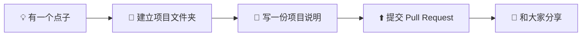
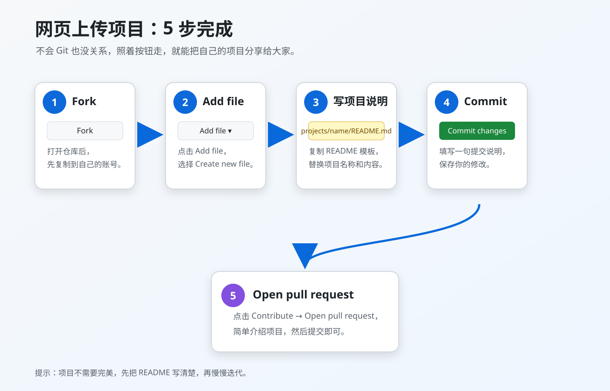

# 🚀 AIAADC Student Projects

> **把你做过的小东西，变成大家都能看见的作品。**

这是 AIAADC 同学的开放项目仓库，专门收集大家自发完成的小项目、个人尝试和有趣创意。

你不需要等项目“足够厉害”才来上传：

- 一个周末做出来的网页
- 一段解决实际问题的 Python 脚本
- 一个 AI 小工具或工作流
- 一次课程之外的实验
- 一个还在迭代中的 Demo
- 一个你希望有人一起完善的想法

只要它是你认真做出来、愿意分享的东西，就值得被记录。

[](https://github.com/AIAADC/student-projects/tree/main/projects)
[](https://github.com/AIAADC/student-projects/pulls)
[](https://github.com/AIAADC)

## 🗂️ 项目目录

所有项目按“作者-项目名”建立独立目录，方便快速找到作者、项目说明和演示地址：

- [项目总目录](projects/README.md)
- [AI 前沿情报站 · WenNinghan](projects/ai-frontier-intel-station-WenNinghan/)

---

## 🌱 为什么要上传？

上传项目不只是“把代码放上来”：

- **给未来的自己留一个作品记录**
- **让同学知道你在做什么**
- **获得建议、反馈和潜在的合作伙伴**
- **帮助后来者学习你的思路**
- **把一个小想法变成可以持续迭代的项目**

这里不比较项目大小，也不要求统一技术栈。我们更在意：项目是真实的、说明是清楚的、别人能够理解并继续使用。

## 📦 这里适合放什么？

以下类型都欢迎：

| 类型 | 示例 |
| --- | --- |
| 网页与应用 | 个人主页、小游戏、效率工具、课程辅助工具 |
| AI 项目 | 聊天机器人、自动化脚本、提示词工具、模型应用 |
| 数据与算法 | 数据分析、可视化、算法练习、爬虫与信息整理 |
| 硬件与嵌入式 | Arduino、树莓派、传感器、电子制作 |
| 学习与实验 | 课程延伸、技术验证、阅读复现、实验性 Demo |
| 其他创意 | 任何你觉得值得分享的小项目 |

项目可以是个人完成，也可以是小组合作；可以已经完成，也可以仍在持续更新。

## 🐾 已上架的 Codex 宠物

先来看看已经上传的两个小伙伴。每个项目同时保留在本仓库的轻量安装目录，并链接到作者维护的完整项目仓库：

| 宠物 | 作者 | 本库目录 | 完整项目仓库 | 可安装包 |
| --- | --- | --- | --- | --- |
| 月薪喵 | WenNinghan | [项目目录](projects/yuexinmiao-WenNinghan/) | [yuexinmiao-codex-pet](https://github.com/WenNinghan/yuexinmiao-codex-pet) | [dist/yuexinmiao](https://github.com/WenNinghan/yuexinmiao-codex-pet/tree/main/dist/yuexinmiao) |
| 呆猫八条 | WenNinghan | [项目目录](projects/daimaobatiao-WenNinghan/) | [daimaobatiao-codex-pet](https://github.com/WenNinghan/daimaobatiao-codex-pet) | [dist/daimaobatiao](https://github.com/WenNinghan/daimaobatiao-codex-pet/tree/main/dist/daimaobatiao) |

本仓库中的目录适合快速浏览和安装；完整项目仓库包含源文件、预览、验证报告和构建/发布资料。

如果你也做过 Codex 宠物、桌面小工具、网页 Demo 或其他有趣作品，欢迎用同样的方式上传。

## 🧭 最短上架路径



### 🖼️ 网页上传按钮指引

不熟悉 GitHub 操作时，可以按图中的箭头依次点击：



## 🖱️ 不熟 Git？用网页就能上传

这是最适合第一次提交的方式：

1. 打开本仓库：<https://github.com/AIAADC/student-projects>
2. 点击 **Fork**，创建自己的副本。
3. 在自己的仓库中点击 **Add file → Create new file**。
4. 在文件名中直接填写：

   `projects/项目名-你的GitHub用户名/README.md`

   GitHub 会自动创建文件夹。
5. 把下面的项目模板复制进去，替换其中的占位内容。
6. 如果还有代码或图片，继续使用 **Add file → Upload files** 上传到同一个项目文件夹。
7. 点击 **Commit changes**，然后点击 **Contribute → Open pull request**。
8. 在 Pull Request 描述中简单介绍你的项目，提交即可。

> 如果项目文件较多，推荐先 Fork，再通过 Git 上传；如果只是一个小脚本或 Demo，网页上传完全够用。

## 💻 熟悉 Git？用命令行上传

将下面的命令中的地址和项目名称替换成你自己的：

```bash
git clone https://github.com/你的用户名/student-projects.git
cd student-projects

mkdir -p projects/your-project-name
# 把项目文件放入 projects/your-project-name/

git add projects/your-project-name
git commit -m "Add your-project-name"
git push origin main
```

然后打开你的 GitHub 仓库页面，点击 **Contribute → Open pull request**，提交 Pull Request。

如果你没有推送到主仓库的权限，请先 Fork，再把代码推送到自己的仓库。

## 🗂️ 推荐目录结构

```text
projects/
└── 项目名-你的GitHub用户名/
    ├── README.md              # 项目说明，建议必须有
    ├── src/                   # 源代码
    ├── assets/                # 图片、演示素材
    ├── requirements.txt       # Python 依赖（如有）
    ├── package.json           # Node.js 依赖（如有）
    └── LICENSE                # 项目许可证（可选）
```

项目不需要严格遵守这个结构。最重要的是：

1. 每个项目有自己的独立文件夹。
2. 项目目录里有一份别人看得懂的 README。
3. 不上传敏感信息和未经授权的材料。

## ✍️ 项目 README 模板

复制下面的内容，放进 `projects/项目名-你的GitHub用户名/README.md`：

```markdown
# 项目名称

用一句话介绍你的项目。

## 👋 项目简介

我为什么做这个项目？它解决了什么问题？

## ✨ 主要功能

- 功能一
- 功能二
- 功能三

## 🛠️ 技术栈

- Python / JavaScript / C++ / Arduino / 其他
- 使用到的框架、库或服务

## 🚀 如何运行

```bash
# 安装依赖
# 运行项目
```

## 🎬 演示

可以放截图、GIF、视频链接、在线 Demo 或使用示例。

## 👤 作者

- 姓名 / GitHub 用户名
- 联系方式或主页（可选）

## 🗺️ 后续计划

- [ ] 计划一
- [ ] 计划二

## 📄 License

如有需要，在这里说明项目使用的 License。
```

不会写完整 README 也没关系，先把项目传上来，后面再慢慢补充。

## ✅ 提交前检查清单

提交 Pull Request 前，快速检查一下：

- [ ] 项目放在 `projects/项目名-作者名/` 独立目录中
- [ ] 项目有基本说明
- [ ] 已写明作者或参与者
- [ ] 已说明运行方式，或注明“暂未整理运行方式”
- [ ] 没有上传密码、API Key、Token、个人隐私等敏感信息
- [ ] 没有上传未经授权的代码、数据、图片、字体或视频
- [ ] 外部 API、模型、数据集和服务已经注明来源
- [ ] 如果项目仍在开发中，已经标注当前状态

## 🤝 Pull Request 会检查什么？

维护者主要关注这些基础问题：

- 项目是否能被基本理解
- 文件位置是否清晰
- 是否包含明显的敏感信息
- 是否存在明显的版权或安全风险
- README 是否足以帮助别人开始了解项目

我们不会因为项目“不够复杂”而拒绝它，也不会要求所有项目使用同一种语言或框架。

## 💬 如何参与别人的项目？

你可以：

- 提 Issue 提出建议或报告问题
- 修复 Bug 并提交 Pull Request
- 帮忙补充 README 和使用示例
- 分享项目，邀请更多同学试用
- 和作者一起把 Demo 继续做下去

## 📮 不确定能不能传？

直接提交 Issue，或者先发一个草稿 Pull Request。没有“完美准备好”这回事，先让项目被看见，通常就是最好的开始。

---

## 📄 License

本仓库不自动为所有项目指定统一 License。每个项目可以在自己的目录中单独声明 License。

如果一个项目没有声明 License，请先联系作者，再复制、修改或分发其中的代码和素材。

## ⭐ 现在就上传你的第一个项目

打开 <https://github.com/AIAADC/student-projects>，把你最近做过的一个小项目放进来。

**不必等它完美，先让它被看见。**
