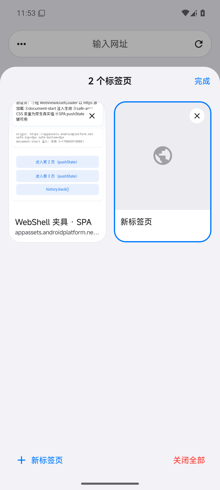
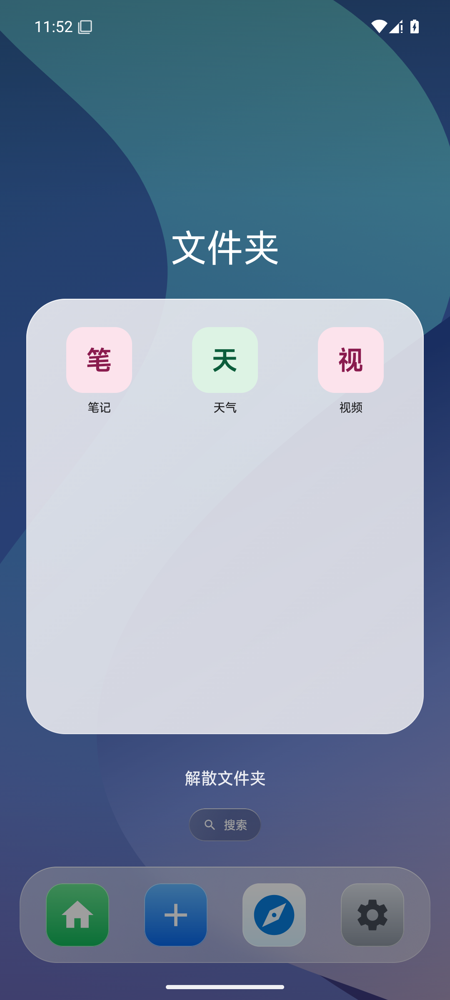

# 玄览 · PocketWebShell

> 把常用网站变成一个可整理、可拖动、可多会话运行的 Android 口袋桌面。

玄览（应用内名称 **WebShell**）是一款面向手机的多站点 Web Shell。输入网址后，它会自动解析站点标题和图标，生成类似桌面 App 的入口；入口可以固定容量分页、重排或合并成文件夹，并以独立 WebView 会话运行。项目同时提供多标签浏览、站点显示策略、通知、电池优化和后台服务设置，是一个仍在持续迭代的个人开源项目。

## 🌐 项目官网与开源仓库

| 入口 | 地址 | 说明 |
| --- | --- | --- |
| 🏠 项目官网（手机端下载） | https://xuanlan.1037solo.com/ | 官方下载与产品介绍，包含最新安装包 |
| 📦 开源仓库（完整源码） | https://github.com/AIMFllyYS/PocketWebShell | 完整源码、Releases、Issues 与开发记录 |
| 📁 本目录 | `projects/xuanlan-AIMFllyYS/` | AIAADC 学生项目的轻量展示副本 |

本目录用于快速浏览和了解项目；完整源码、构建与发布资料请前往上方开源仓库。**欢迎任何人提交 Issue、Pull Request 或参与共建**（见下方「欢迎共建」）。

## 👋 项目简介

普通浏览器书签适合「收藏」，但不擅长高频站点的手机化组织。玄览关注的是更接近 Launcher 的使用方式：

- 添加后直接出现在桌面网格；
- 图标尺寸和页容量稳定，不因远程图片改变布局；
- 长按后由独立浮层跟随手指，原位置保留占位；
- 普通区域松手重排，中心悬停合并文件夹，边缘悬停跨页；
- 每个站点保留自己的显示和运行策略。

项目由个人发起并持续维护，已迭代至 v0.1.16，所有版本变更记录在开源仓库的 [CHANGELOG.md](CHANGELOG.md)。

## ✨ 主要功能

- **网站添加**：URL 规范化、HTML 元数据解析、多来源图标候选与保存前编辑。
- **手机桌面**：可配置行列、图标大小、圆角、标题和页码。
- **稳定分页**：按 `行数 × 列数` 固定容量分页，满页时「添加」入口自动进入新页。
- **Launcher 式拖动**：独立浮层、触觉反馈、重排、文件夹热点和边缘翻页。
- **多标签浏览**：地址栏、返回、前进、刷新、新建标签和标签切换器。
- **多会话 WebView**：站点独立 Profile、WebView 池、本地资源加载。
- **系统状态联动**：通知运行时权限、电池优化白名单状态和前台服务开关。

## 🛠️ 技术栈

- **Kotlin 2.4.10 + Jetpack Compose**（Material 3 / iOS 风格设计系统）
- **AGP 9.3.2**、Hilt 2.60.1、Room 2.8.4、DataStore 1.2.1、AndroidX WebKit 1.17.0
- Navigation 3、前台服务、多模块 Gradle 工程（`app` / `core` / `feature`）

架构遵循单向数据流：Composable 负责呈现与事件，ViewModel 暴露 `StateFlow`，Repository 负责 Room/DataStore，平台对象和 WebView 生命周期留在专用宿主与控制器中。

## 🚀 如何运行

环境要求：JDK 17、Android SDK 37、Android 10（API 29）及以上；仓库自带 Gradle Wrapper。

```powershell
git clone https://github.com/AIMFllyYS/PocketWebShell.git
cd PocketWebShell
.\gradlew.bat :app:assembleDebug
```

macOS / Linux：

```bash
./gradlew :app:assembleDebug
```

Debug APK 输出到 `app/build/outputs/apk/debug/app-debug.apk`。正式安装包请从[项目官网](https://xuanlan.1037solo.com/)或开源仓库的 [GitHub Releases](https://github.com/AIMFllyYS/PocketWebShell/releases) 下载。

## 📸 演示

| iOS 风格主屏 | 分组设置 | 多标签浏览 | 文件夹 |
| --- | --- | --- | --- |
|  |  |  |  |

截图来自离线测试数据和图标加载兜底，仅用于功能展示。

## 👤 作者

- **AIMFllyYS**（YuSheng），华中科技大学学生开发者
- GitHub：https://github.com/AIMFllyYS
- 项目官网：https://xuanlan.1037solo.com/

## 🤝 欢迎共建

这是一个认真的个人开源项目，任何形式的参与都欢迎：

- 提 **Issue** 反馈问题、建议新功能或讨论设计；
- **Fork** 仓库、修复 Bug 或实现功能后提交 **Pull Request**；
- 帮忙完善文档、README 和使用示例；
- 分享给更多同学试用，让项目被更多人看见；
- 和作者一起把 Demo 继续做下去。

提交前请阅读开源仓库的 [CONTRIBUTING.md](CONTRIBUTING.md)（分支规范、Conventional Commits 与 PR 检查清单）。

## 🗺️ 后续计划

- 桌面小组件（Widget）；
- 更多站点显示策略与脚本注入能力；
- 跨设备会话同步；
- 更完善的图标库与主题自定义。

详细路线和讨论见开源仓库的 Issues 与更新日志。

## 📄 License

Apache License 2.0。详见 [LICENSE](LICENSE)。
