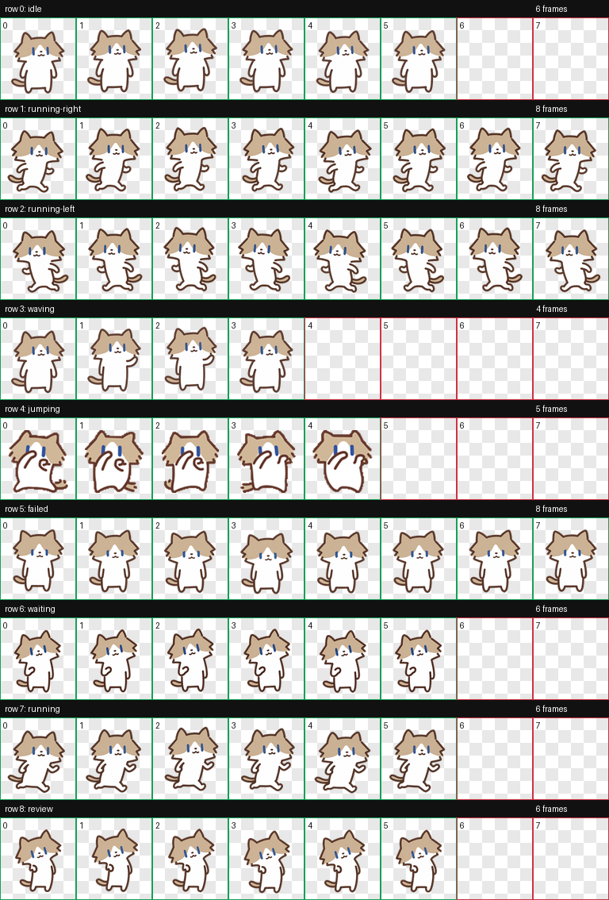
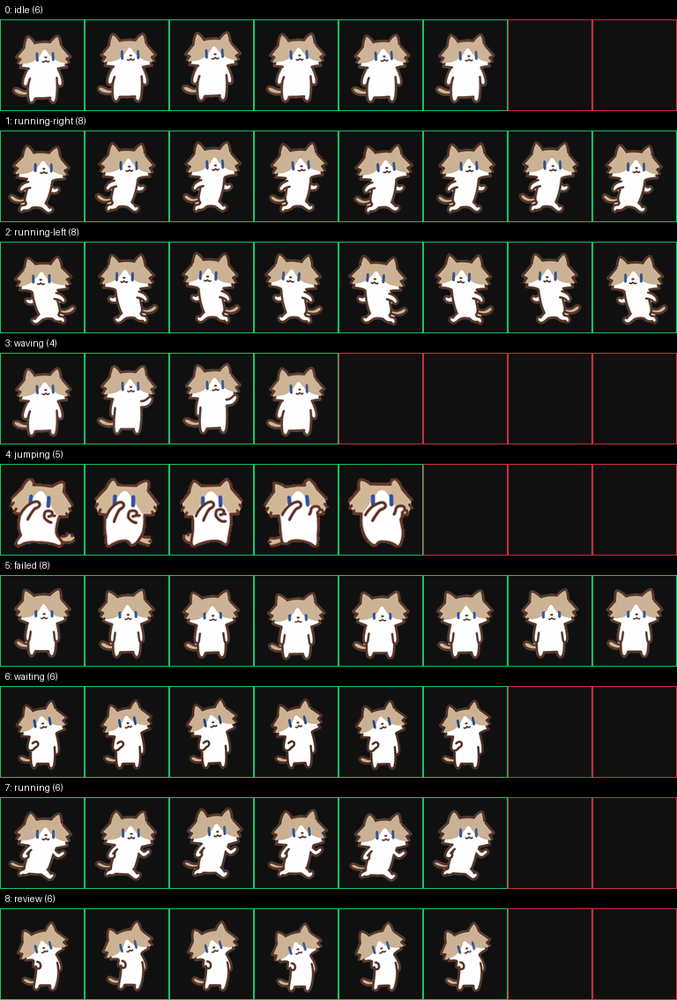

# 月薪喵

一个轻巧、活泼的黄白小猫 Codex App 宠物。

## 项目档案

- **作者**：WenNinghan（GitHub 用户名）
- **版本**：3.0.1
- **项目状态**：已验证的可安装发布包
- **完整项目仓库**：[WenNinghan/yuexinmiao-codex-pet](https://github.com/WenNinghan/yuexinmiao-codex-pet)
- **完整安装包目录**：[dist/yuexinmiao](https://github.com/WenNinghan/yuexinmiao-codex-pet/tree/main/dist/yuexinmiao)
- **本目录位置**：`AIAADC/student-projects/projects/yuexinmiao-WenNinghan/`

完整仓库包含源文件、预览图、验证报告、构建脚本和发布说明；本目录提供可直接复制安装的核心文件。

## 🐾 效果预览

### 全部动作一览



### 透明背景检查



### 动画演示

| 待机 | 跑动 | 挥手 |
| --- | --- | --- |
|  |  |  |

| 跳跃 | 等待 | 审阅 |
| --- | --- | --- |
|  |  |  |

更多动作动画可在 [`previews/animations`](previews/animations/) 中查看。

## 文件

- `pet.json`：宠物配置
- `spritesheet.webp`：动画精灵表

## 安装

将本目录复制到：

```text
%USERPROFILE%\.codex\pets\yuexinmiao
```

确保目录中同时存在 `pet.json` 和 `spritesheet.webp`，然后重启 Codex App，或切换一次宠物后重新选择“月薪喵”。

也可以直接下载：

- [`pet.json`](https://raw.githubusercontent.com/WenNinghan/yuexinmiao-codex-pet/main/dist/yuexinmiao/pet.json)
- [`spritesheet.webp`](https://raw.githubusercontent.com/WenNinghan/yuexinmiao-codex-pet/main/dist/yuexinmiao/spritesheet.webp)

## 说明

这是月薪喵的可安装发布包。素材版权和使用范围请遵循作者的约定；未经作者许可，请不要将素材用于商业发布、二次分发或制作衍生包。
